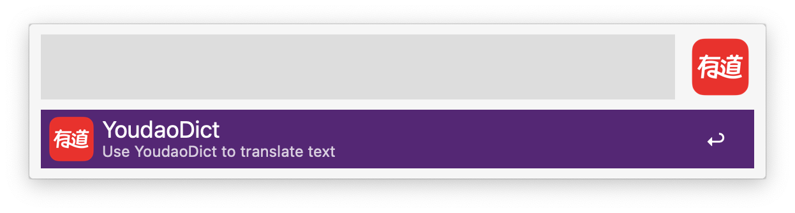
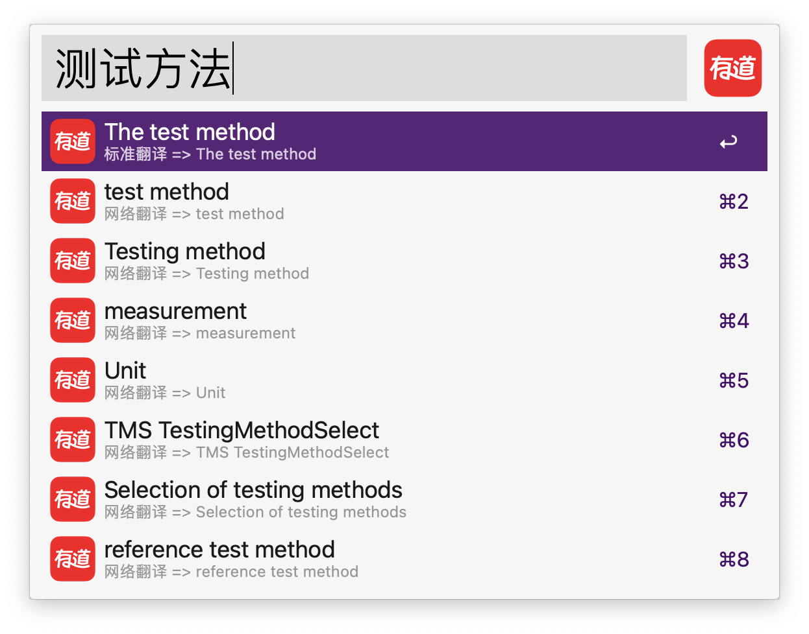
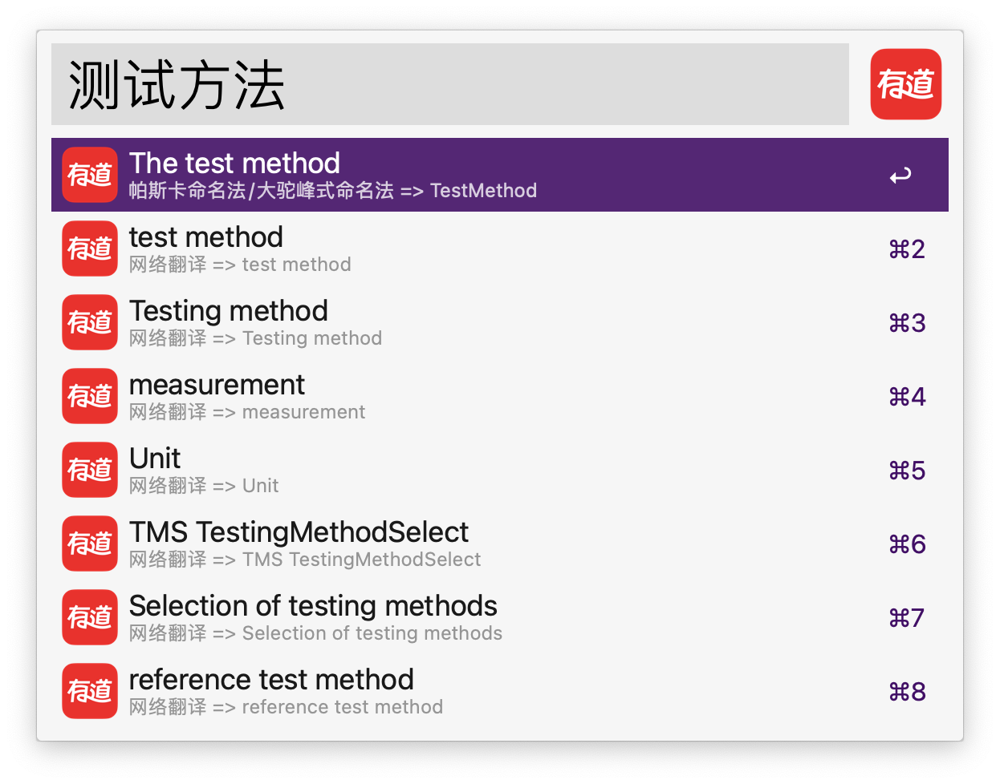

## @wangliang/alfred-youdaodict

*Alfred工作流，使用有道词典去翻译文本*
*An Alfred workflow uses YoudaoDict for translation*

### 运行环境

* MacOS
* Nodejs 14.x.x
* Alfred Powerpack

### 安装

```
npm i -g @liangshen/alfred-youdaodict
```

### 使用方法

可使用 option + Y 快捷键调出本工作流搜索框(或者调出alfred搜索框输入关键字 youdaodict)




然后输入想要翻译的内容, 可以是中文和英文(中英互译) 


* 回车可以复制选中的翻译内容
* 按command键 可以查看驼峰式命名法命名，回车复制命名
  
* 按option键 可以查看帕斯卡命名法/大驼峰式命名法命名，回车复制命名
  
* 按ctrl键 可以查看下划线命名法命名，回车复制命名
  
* 按fn键 可以查看中划线命名法命名，回车复制命名
  
* 按shift键 可以查看全大写下划线命名法/常量命名，回车复制命名
  
